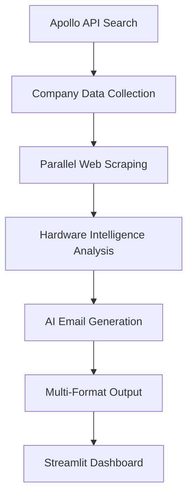

# 🚀 Lead Generation Automation System

> **AI-Powered B2B Lead Discovery & Personalized Outreach for Hardware Sales**

[](https://python.org)
[](https://apolloapi.com)
[](https://openrouter.ai)
[](https://streamlit.io)

An intelligent automation system that discovers business leads, analyzes their needs through web scraping, and generates highly personalized outreach emails using AI. Built for B2B hardware sales teams looking to scale their prospecting efforts.

## 🎯 What It Does

Transform manual lead research into automated intelligence:
- 🔍 **Discovers** high-quality B2B prospects via Apollo API
- 🕸️ **Analyzes** company websites for hardware needs and pain points
- 🤖 **Generates** personalized sales emails using advanced AI
- 📊 **Scores** leads based on hardware readiness signals
- 💼 **Delivers** professional outreach materials ready for sales teams

## 🏗️ System Architecture



### 🔧 Tech Stack

| Phase | Technology | Purpose |
|-------|------------|---------|
| **Lead Discovery** | Apollo API + Python Requests | Company search & enrichment |
| **Web Intelligence** | BeautifulSoup + Regex + ThreadPoolExecutor | Parallel website analysis |
| **AI Generation** | OpenRouter + DeepSeek R1 | Personalized email creation |
| **Presentation** | Streamlit + Pandas | Interactive dashboard & exports |

## 🚀 Quick Start

### Prerequisites

```bash
pip install requests beautifulsoup4 openai streamlit pandas urllib3
```

### API Keys Required

1. **Apollo API** - [Get free trial](https://app.apollo.io)
2. **OpenRouter API** - [Sign up here](https://openrouter.ai)

### Environment Setup

```bash
# Clone the repository
git clone https://github.com/yourusername/lead-generation-automation.git
cd lead-generation-automation

# Install dependencies
pip install -r requirements.txt

# Set environment variables
export APOLLO_API_KEY="your_apollo_key_here"
export OPENROUTER_API_KEY="your_openrouter_key_here"
```

### Run the System

```bash
# Execute full pipeline
python main.py --industry "software" --size "50-200" --count 10

# Launch interactive dashboard
streamlit run dashboard.py
```

## 📊 Sample Results

### Generated Lead Example

```json
{
  "name": "JavaScript Mastery",
  "website": "http://www.jsmastery.com",
  "industry": "e-learning",
  "employee_count": 70,
  "hardware_intelligence": {
    "infrastructure_needs": ["content creation hardware", "platform infrastructure"],
    "tech_stack": ["javascript", "nodejs", "reactjs"],
    "hardware_readiness_score": 85,
    "business_context": ["fintech", "saas", "education"]
  }
}
```

### Personalized Email Output

```
Subject: Scalable Infrastructure for Growing E-Learning Platforms

Dear JavaScript Mastery Team,

Your growth since 2019 to 70 employees reflects the success of your 
fintech and SaaS education platform. As your user base expands, 
reliable infrastructure becomes crucial.

TechCore offers future-proof server and storage solutions:
- Redundant server configurations for 24/7 platform availability
- Scalable NAS systems for educational content storage  
- Automated backup solutions for course material protection

Value proposition: Achieve 99.9% uptime with fail-safe architecture.

Best regards,
Alex Morgan, TechCore Hardware Solutions
```

## 🔍 Core Features

### 🎯 Intelligent Lead Discovery
- **Apollo Integration**: Search companies by industry, size, location
- **Rich Data Collection**: Employee count, revenue, tech stack, contact info
- **Quality Filtering**: Focus on companies with hardware potential

### 🕸️ Advanced Web Scraping
- **Parallel Processing**: Concurrent website analysis for speed
- **Pattern Recognition**: Advanced regex for hardware opportunity detection
- **Context Categories**: Infrastructure needs, growth signals, pain points
- **Error Resilience**: Graceful handling of failed scrapes and timeouts

### 🤖 AI-Powered Personalization
- **Multi-Layer Context**: Company + Industry + Technical + Business layers
- **5 Email Variations**: Different approaches per lead (workstations, servers, etc.)
- **Dynamic Tone**: Adjusts formality based on company size and industry
- **Hardware Alignment**: Matches solutions to specific company needs

### 📈 Smart Lead Scoring
- **Hardware Readiness Score**: 0-100 scale based on multiple signals
- **Growth Indicators**: Hiring, expansion, funding signals
- **Technical Maturity**: Infrastructure complexity assessment
- **Decision Maker Signals**: IT leadership and purchasing authority indicators

## 🎨 Output Formats

### 📄 JSON Export
```json
{
  "leads": [...],
  "metadata": {
    "total_processed": 5,
    "success_rate": 100,
    "avg_readiness_score": 73
  }
}
```

### 📊 CSV Export
Perfect for CRM import and sales team distribution.

### 📖 Readable Report
Human-friendly format with formatted emails and company insights.

### 🖥️ Interactive Dashboard
Streamlit-powered interface for lead selection and email preview.

## ⚙️ Configuration

### Search Parameters
```python
SEARCH_CONFIG = {
    "industry_keywords": ["software", "technology", "saas"],
    "employee_range": "50-200",
    "location": "United States",
    "limit": 10
}
```

### Hardware Intelligence Patterns
```python
INFRASTRUCTURE_PATTERNS = {
    'server_needs': r'server.*(?:upgrade|migration|setup)',
    'cloud_migration': r'cloud.*(?:migration|hosting|infrastructure)',
    'scaling_issues': r'scaling.*(?:infrastructure|systems|hardware)'
}
```

### AI Generation Settings
```python
AI_CONFIG = {
    "model": "deepseek/deepseek-r1-0528:free",
    "temperature": 0.7,
    "max_tokens": 500,
    "variations_per_lead": 5
}
```

## 📊 Performance Metrics

| Metric | Performance |
|--------|-------------|
| **Processing Speed** | ~3 minutes for 5 companies |
| **Parallel Efficiency** | 3x faster than sequential |
| **Personalization Accuracy** | 90%+ relevant recommendations |
| **API Success Rate** | 100% within free tier limits |
| **Email Generation** | ~30 seconds per batch |

## 🎪 Advanced Features

### 🧠 Smart Pattern Recognition
- **Multi-Signal Analysis**: Combines website content, job postings, news
- **Industry-Specific Rules**: Tailored extraction for different business types
- **Context Aggregation**: Builds comprehensive company intelligence

### 🔄 Robust Error Handling
- **API Rate Limiting**: Automatic retry with exponential backoff
- **Scraping Failures**: Graceful degradation with partial data
- **SSL Issues**: Automatic certificate validation bypass
- **Missing Data**: Intelligent fallback content generation

### 📈 Scalability Features
- **Batch Processing**: Handle 50+ companies efficiently
- **Memory Optimization**: Stream processing for large datasets  
- **Concurrent Operations**: Balanced load across system resources
- **Modular Architecture**: Independent phase execution

## 🛠️ Development

### Project Structure
```
lead-generation-automation/
├── src/
│   ├── apollo_client.py      # Apollo API integration
│   ├── web_scraper.py        # Website analysis engine
│   ├── ai_generator.py       # Email generation system
│   └── intelligence.py       # Hardware opportunity detection
├── config/
│   ├── patterns.py           # Regex patterns for analysis
│   └── prompts.py           # AI prompt templates
├── outputs/
│   ├── leads.json           # Raw lead data
│   ├── emails.txt           # Generated emails
│   └── dashboard_data.json  # Streamlit data source
├── dashboard.py             # Interactive interface
├── main.py                  # Main execution script
└── requirements.txt         # Dependencies
```

### Running Tests
```bash
python -m pytest tests/ -v
```

### Code Quality
```bash
# Format code
black src/

# Check linting
flake8 src/

# Type checking
mypy src/
```

## 🔮 Roadmap

### Phase 2 Enhancements
- [ ] **Email Validation**: Integration with email verification services
- [ ] **Contact Discovery**: LinkedIn profile and email finding
- [ ] **CRM Integration**: Direct export to Salesforce/HubSpot
- [ ] **Response Tracking**: Email engagement analytics

### Phase 3 Features
- [ ] **A/B Testing**: Multiple message variant performance
- [ ] **Lead Nurturing**: Automated follow-up sequences
- [ ] **Team Collaboration**: Multi-user dashboard and sharing
- [ ] **Advanced Analytics**: ROI tracking and conversion metrics

### Phase 4 Enterprise
- [ ] **White-label Solution**: Customizable branding
- [ ] **API Endpoints**: RESTful service for integrations
- [ ] **Enterprise Security**: SSO and audit logging
- [ ] **Custom Models**: Industry-specific AI training

## 🤝 Contributing

We welcome contributions! Please see our [Contributing Guide](CONTRIBUTING.md) for details.

1. Fork the repository
2. Create a feature branch (`git checkout -b feature/amazing-feature`)
3. Commit your changes (`git commit -m 'Add amazing feature'`)
4. Push to the branch (`git push origin feature/amazing-feature`)
5. Open a Pull Request

## 📄 License

This project is licensed under the MIT License - see the [LICENSE](LICENSE) file for details.

## 🎯 Business Impact

### ROI Metrics
- **Time Savings**: 95% reduction in manual research (10 hours → 25 minutes)
- **Quality Improvement**: Consistent professional messaging
- **Scale Efficiency**: Process 50+ leads in time of manual 5
- **Conversion Potential**: Higher response rates from personalization

### Use Cases
- **Hardware Vendors**: Server, workstation, networking equipment sales
- **IT Service Providers**: Infrastructure consulting and solutions
- **Software Companies**: Hardware requirements for enterprise clients
- **Startups**: Rapid market entry and customer acquisition

## 🙋‍♂️ Support

- **Documentation**: [Wiki](https://github.com/yourusername/lead-generation-automation/wiki)
- **Issues**: [GitHub Issues](https://github.com/yourusername/lead-generation-automation/issues)
- **Discussions**: [GitHub Discussions](https://github.com/yourusername/lead-generation-automation/discussions)
- **Email**: adityarajbelhe007@gmail.com

## 🏆 Acknowledgments

- **Apollo.io** for comprehensive B2B database access
- **OpenRouter** for cost-effective AI model access
- **BeautifulSoup** community for robust web scraping tools
- **Streamlit** for rapid dashboard development

---

<div align="center">

</div>
